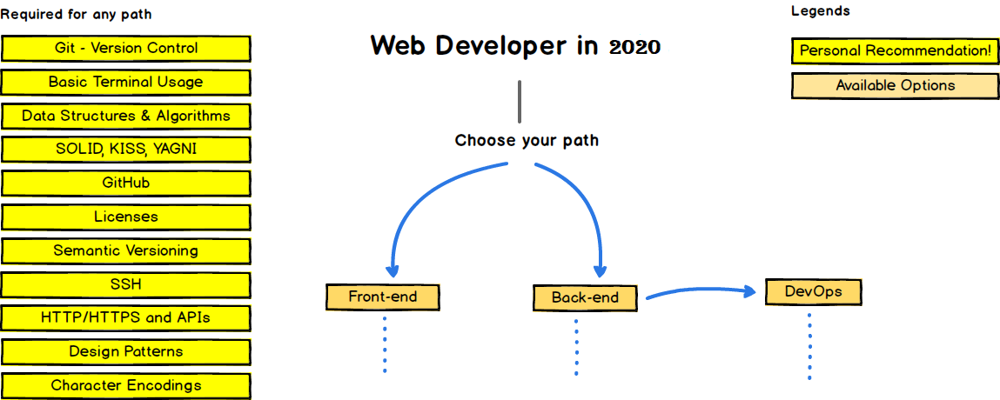
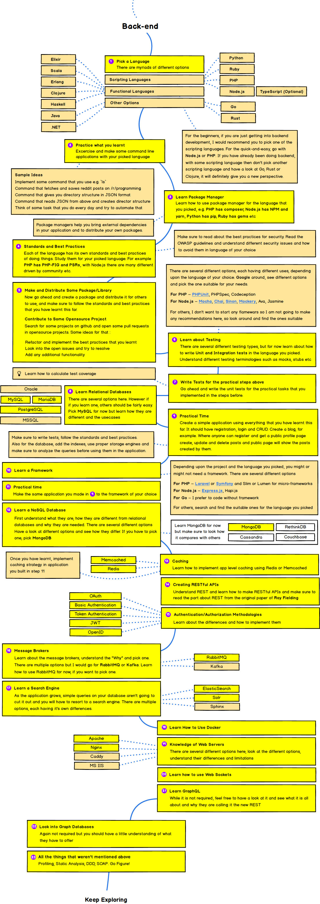
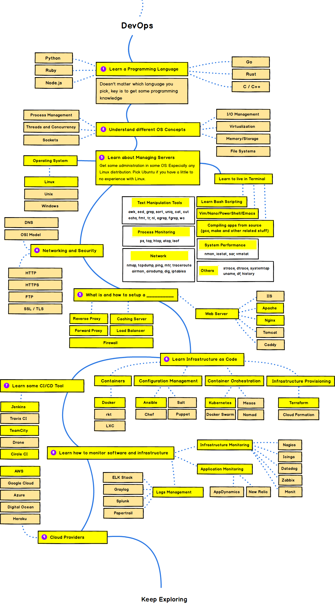

> Roadmap to becoming a web developer in 2019

Below you find a set of charts demonstrating the paths that you can take and the technologies that you would want to adopt in order to become a frontend, backend or a devops. I made these charts for an old professor of mine who wanted something to share with his college students to give them a perspective; sharing them here to help the community.

> The purpose of these roadmaps is to give you an idea about the landscape and to guide you if you are confused about what to learn next and not to encourage you to pick what is hip and trendy. You should grow some understanding of why one tool would better suited for some cases than the other and remember hip and trendy never means best suited for the job.

## Introduction

## Frontend Roadmap

## Back-end Roadmap

## DevOps Roadmap

## 🚦 Wrap Up

If you think any of the roadmaps can be improved, feel free to discuss it in the issues. Also, I will continue to improve this, so you might want to watch this repository or subscribe at [Profile](https://github.com/shub6059) to revisit.

## 🙌 Contribution

> Have a look at [contribution docs](./contributing.md) for how to update any of the roadmaps

- Open pull request with improvements
- Discuss ideas in issues
- Spread the word
- Reach out with any feedback 